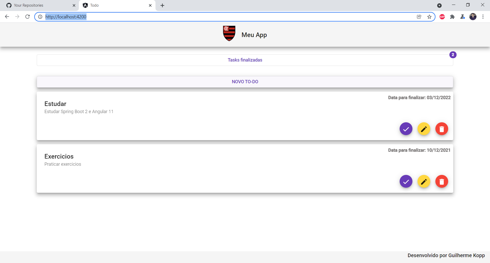

<h1 align="center"> Projeto Full-Stack: </h1>

  <h2 align="center"> Pagina inicialr </h2>
   
 
  <h2 align="center"> Criando novo TO-DO </h2>
  
  
  <h2 align="center"> Tarefas finalizadas </h2>
  
